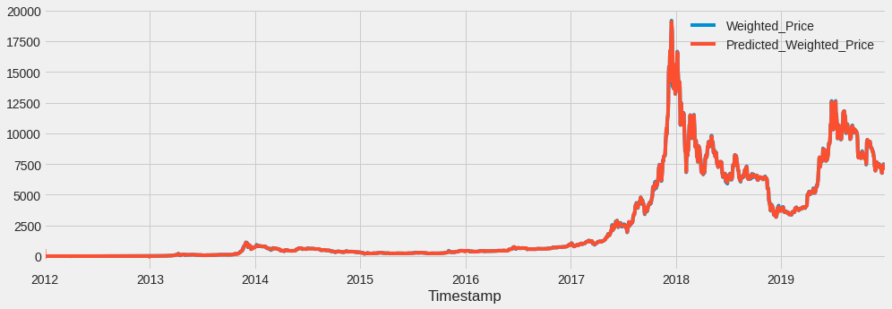

# Prediction-of-bitcoin-price

# Introduction 

The first Bitcoin protocol and proof of concept was published in a Whitepaper in 2009 by a shadowy individual or group under the pseudonym Satoshi Nakamoto. Nakamoto, left the project in late 2010. Other developers took over and the Bitcoin community has since grown exponentially.

In this notebook, we will be deep diving into the dataset, perform some EDA, feature engineering and will predict bitcoin price using Stochastic, Machine Learning and Deep Learning models such as Arima, LSTM, FBprop and XGBoost.

